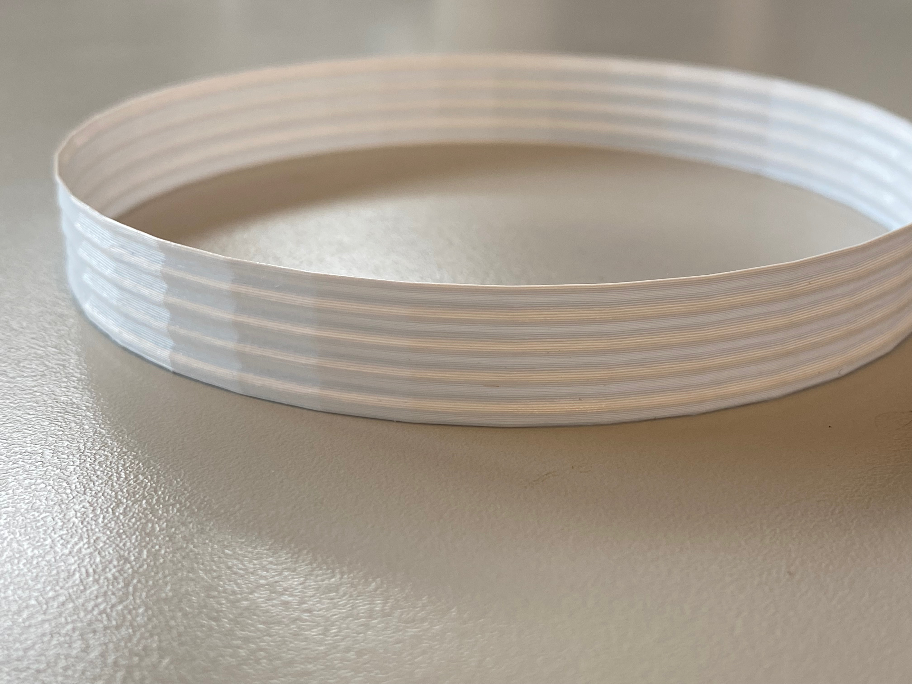
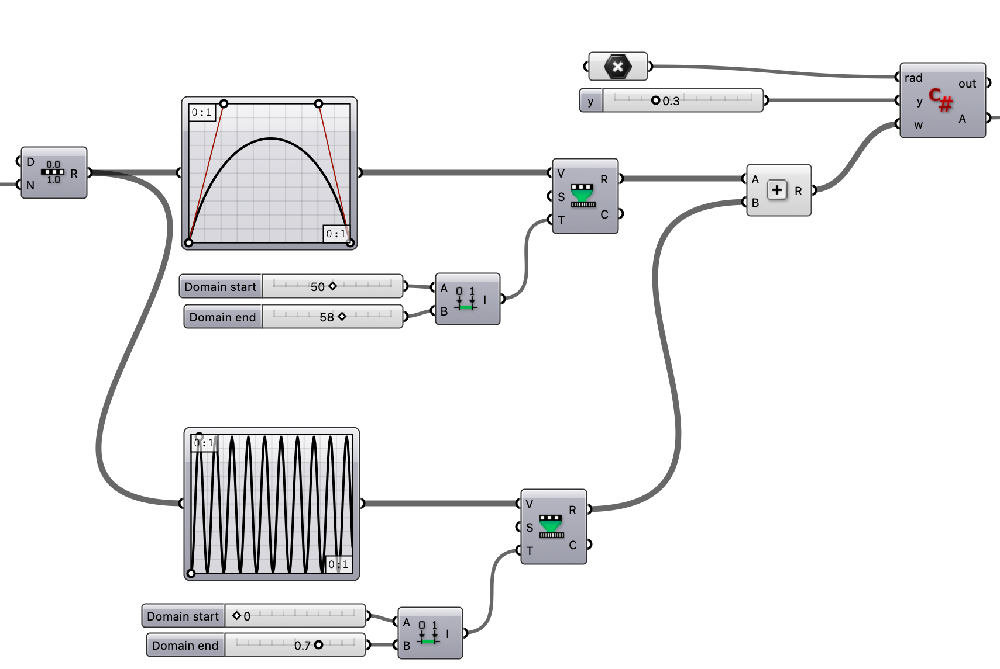
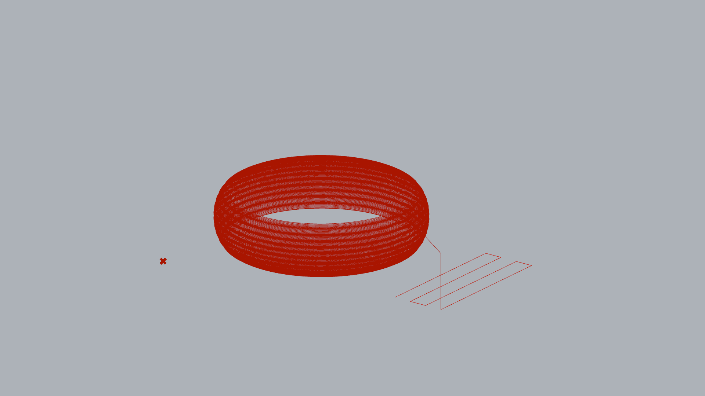

# Bubble shapes

This is my exploration of creating weird bubbly shapes using Grasshopper and Vespidae. 

## 1606_2022

Getting started. First, I've had a hard time getting Vespidae to play nice with my Ultimaker. Vespiade is currently set up to use relative extrusion on Extrusion-Actions, and as it turns out the **The Ultimaker don't like relative extrusion**. I modified Vespidae to have optional relative vs absolute Extrusion and its finally printing as I'm expecting. Ok, that takes care of that. 

I made a quick definition that creates spiral vase prints. I'm using graph mapping to define shape. Here are some snaps: 

