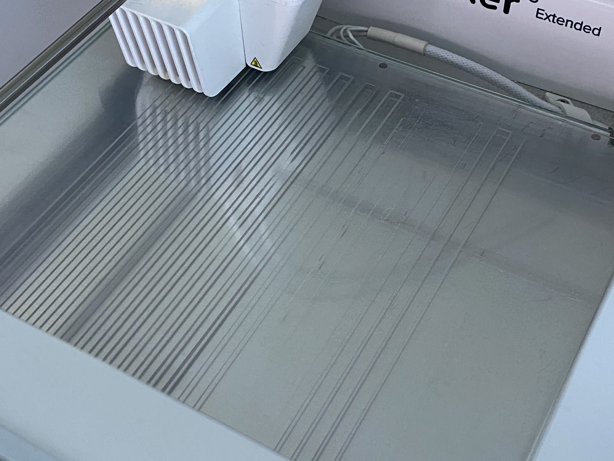
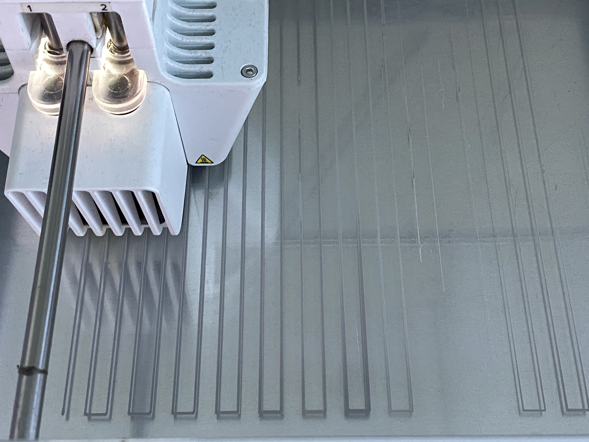

# Scripts for generating gcode

Currently the workflows mainly revolve around a Ultimaker3, but should be easy enough to extend. The ultimaker requires a custom header on top of gcode. See gh-file. Will return in future to document in more detail. At this stage I'm using the scripts to calibrate the Ultimaker, but want to use it to create some solid geometry at some point.

and here is the output in machine

Here is a preview of calibration prints. The print makes it easy to see where the tool-head is too close or visa-versa. 

