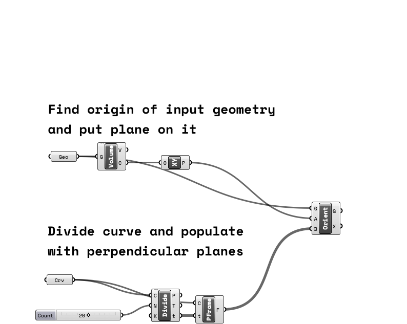

# Copy Object Along Curve
Definition that copies and orients geometry along a curve. See comments in grasshopper. 

High-level explanation: 
- find origin point of input geometry and give it a ground plane 
- divide curve and populate with perpendicular planes. 
- orient geometry from origin plane to curve planes using orient component

