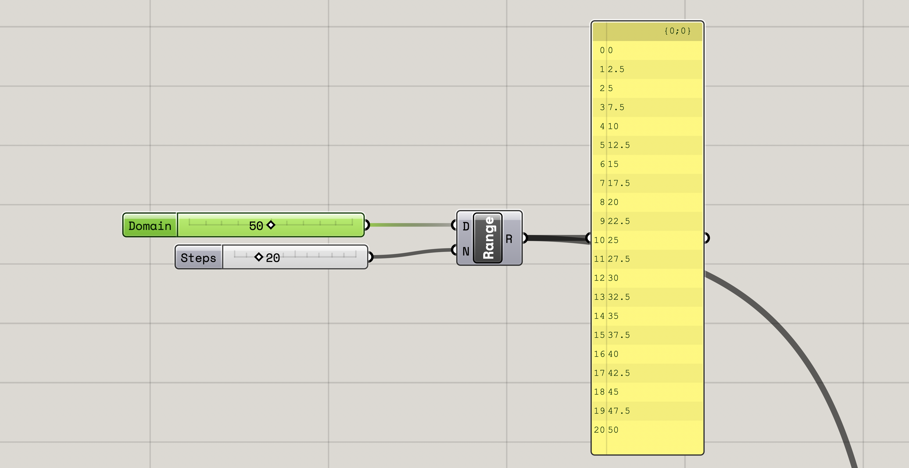
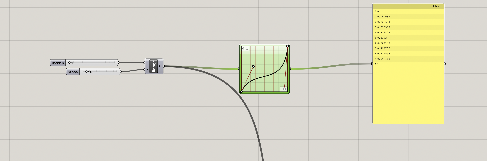
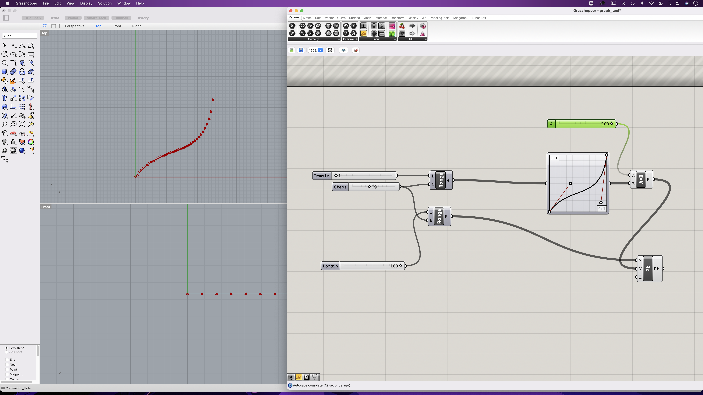

# Graph Tool

Graph mapper let's us explore and create geometry that are based on mathematical functions (bezier, gaussian, parabola, perlin sin, etc). I'm writing this as I am learning. In order to use the Graph Mapper, it's useful to understand what the range component does. The Range component let's us define a range of numbers between 0 and a value. For example we can say that we want 25 numbers distributed between 0 and 50 like this:

Now we can use this data with the Graph Mapping tool, and remap a series of numbers into whatever function we choose in the graph mapper(right click, graph types..). The graph mapper expects data between 0 and 1 (its domain is 0:1 (?)). We can choose how many steps we want to fit between 0 and 1, which will in turn determine how many points we generate. For example, here is a bezier curve mapped over 10 values:

Lets map this data over to some points in rhino. We map the bezier data as Y-coordinates and distribute them over an given x interval (we need to scale the values from the graph mapper for this to make sense. See figure).

That will do for now. I will return in the future and do 3D!
