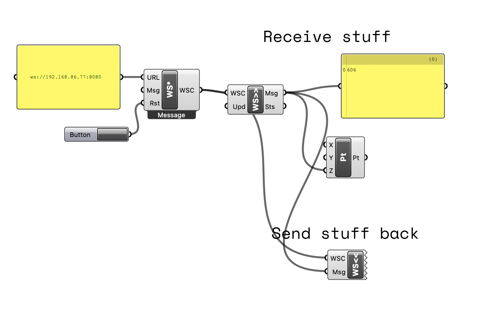

# Communicating with things outside of Rhino / Grasshopper

The goal here is to talk to applications outside of Rhino, or let Rhino receive things from the outside. So far this includes:

- Grasshopper file that sets up a Websocket Client that communicates on port 8080 over your local network. Here we are using the [Bengesht](https://github.com/behrooz-tahanzadeh/Bengesht) library.
- A node.js based Websocket Server
- A nodejs based websocket client for debugging

**Important:** 
- You need to have the Bengesht plugin running in Grasshopper for this to work. 
- remember to add `ws:` before ip adress
## Install nodejs stuff.

1. clone repo
2. navigate to top folder and run `npm init`
3. run `node server.js`
